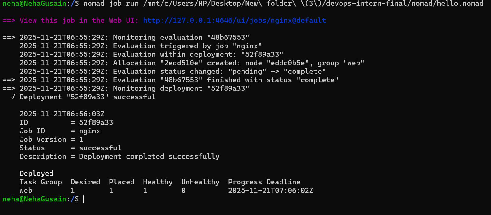
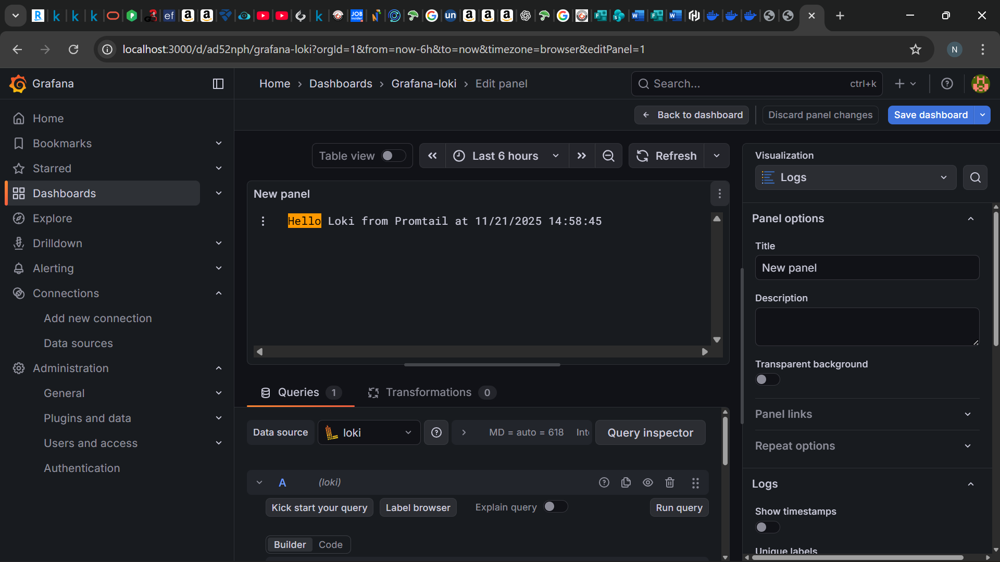

# DevOps Internship Final Assignment

**Name:** Neha Gusain  
**Date:** 21 November 2025  
**Project:** End-to-end DevOps pipeline with Git, Docker, Nomad, CI/CD, and Grafana Loki monitoring.

---

## Project Overview

This repository demonstrates a complete DevOps workflow:
- Git & GitHub setup
- Linux scripting
- Docker containerization
- CI/CD with GitHub Actions
- Job deployment using Nomad
- Log monitoring with Grafana Loki

---

## 1. Git & GitHub Setup

- Created public repository: `devops-intern-final`
- Added `README.md` with project details
- Committed sample script: `hello.py`

### `hello.py`
```python
print("Hello, DevOps!")
 
- python hello.py

---

## 2. Linux & Scripting Basics

- Created folder: scripts/
- Added shell script: sysinfo.sh
scripts/sysinfo.sh
#!/bin/bash
echo "System Information:"
whoami
date
df -h

### Make file executable
chmod +x scripts/sysinfo.sh

### Run the Script
./scripts/sysinfo.sh


----

## 3. Docker Basics

A simple Dockerfile was created to containerize the hello.py script.

Dockerfile
FROM python:3.10-slim
COPY hello.py /app/hello.py
WORKDIR /app
CMD ["python3", "hello.py"]

-Build Docker Image
docker build -t hello-devops .

-Run Container
docker run hello-devops


-Expected output:

Hello, Devops !
c:\Users\HP\OneDrive\Pictures\Screenshots\Screenshot (200).png

---

4. CI/CD with GitHub Actions
- Created workflow: .github/workflows/ci.yml
ci.yml
name: CI Pipeline

on: [push]

jobs:
  build:
    runs-on: ubuntu-latest
    steps:
      - uses: actions/checkout@v3
      - name: Run hello.py
        run: python hello.py


- Added status badge to


---
 5. Job Deployment with Nomad
- Created job file: nomad/hello.nomad
hello.nomad
job "hello-devops" {
  type = "service"

  group "hello-group" {
    task "hello-task" {
      driver = "docker"

      config {
        image = "hello-devops"
      }

      resources {
        cpu    = 100
        memory = 128
      }
    }
  }
}

Run the job
nomad job run nomad/hello.nomad



---

6. Monitoring with Grafana Loki
- Loki and Promtail configured via Docker
- Logs forwarded from container to Loki
- Verified via Grafana Explore
monitoring/loki_setup.txt
Started Loki:
docker run -d --name=loki -p 3100:3100 grafana/loki:2.9.0

Created log folder:
mkdir C:\var\log
echo "Hello Loki from Promtail" >> C:\var\log\test.log

Started Promtail:
docker run -d --name=promtail `
  -v "C:\path\to\promtail-config.yaml:/etc/promtail/promtail-config.yaml" `
  -v "C:\var\log:/var/log" `
  grafana/promtail:2.9.0 `
  --config.file=/etc/promtail/promtail-config.yaml

Verified logs:
curl -G "http://localhost:3100/loki/api/v1/query" --data-urlencode "query={job=\"windows\"}"




